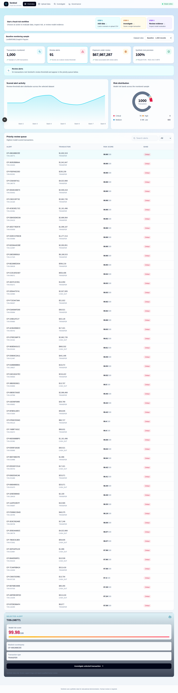
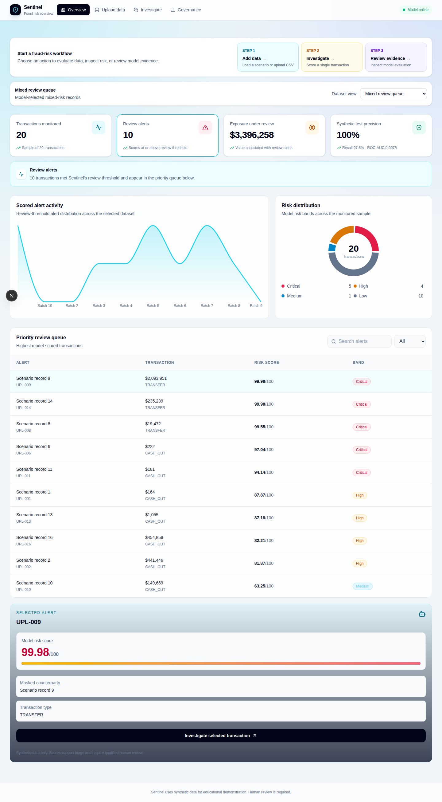
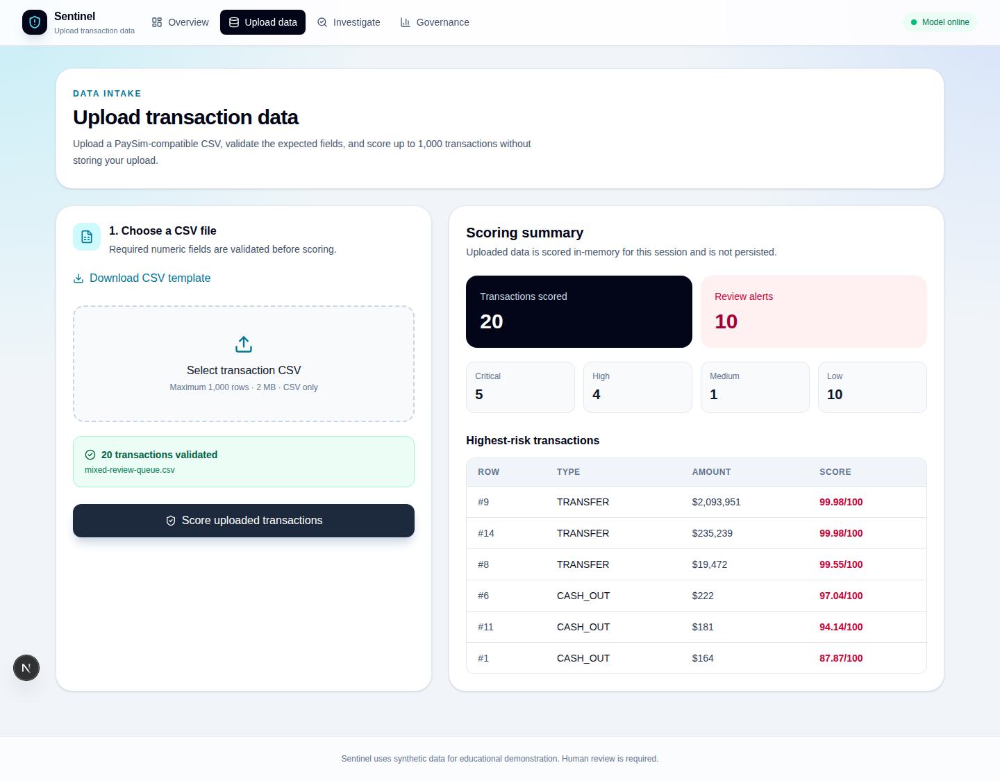
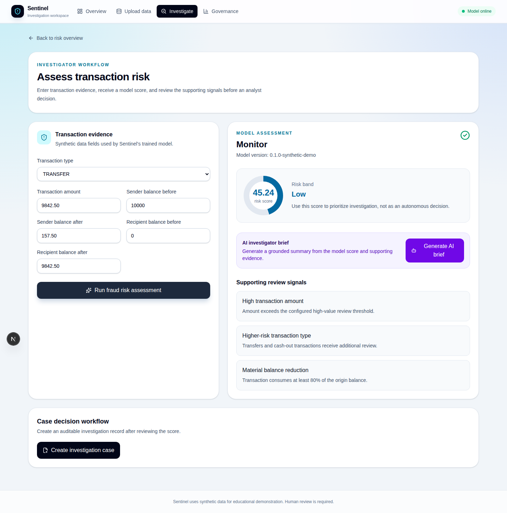
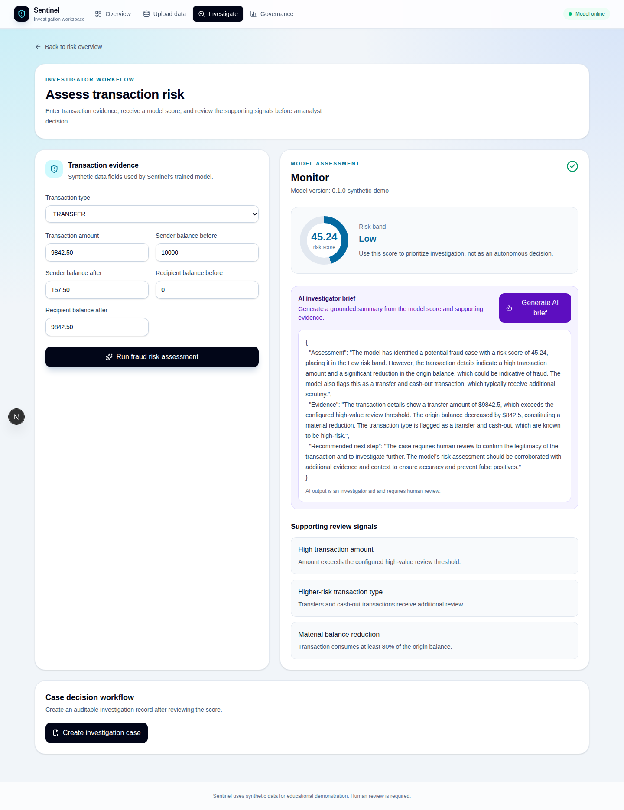
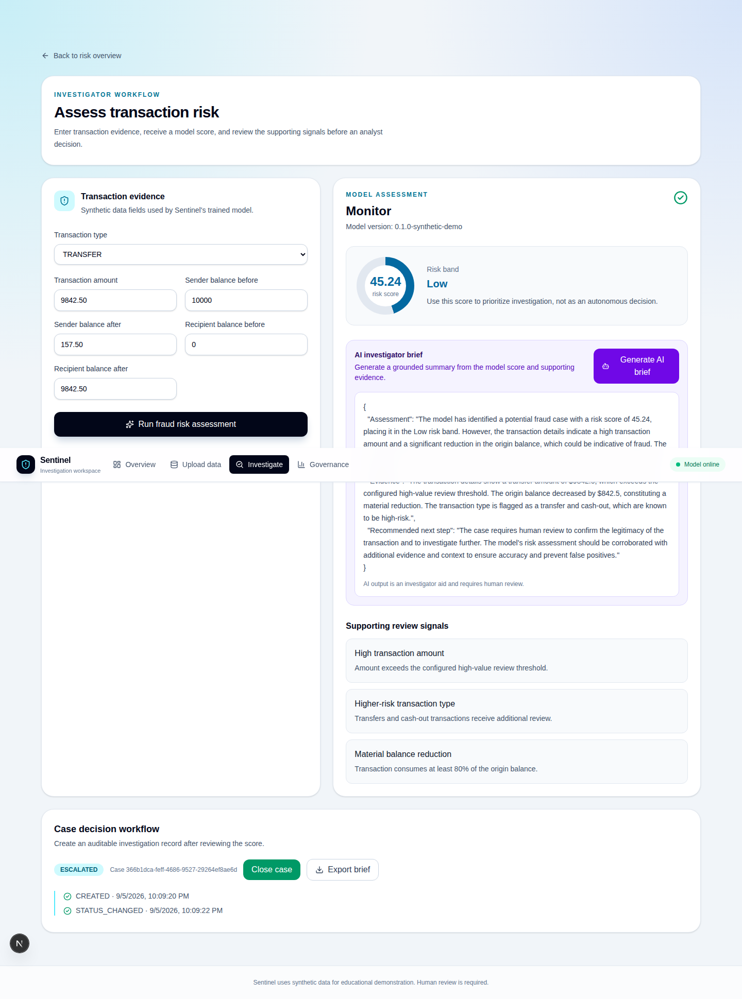
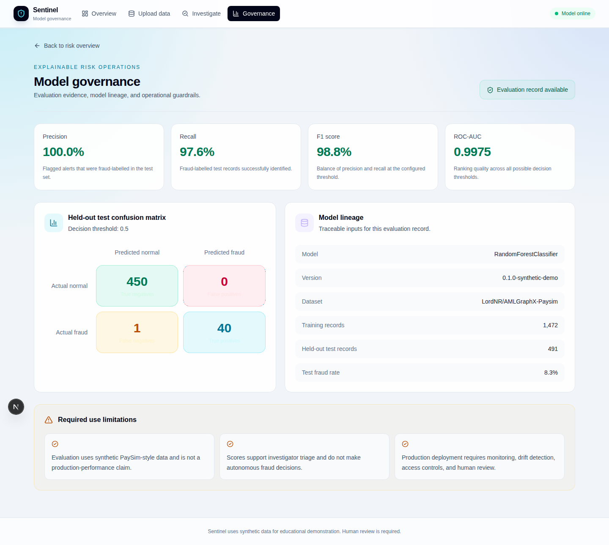
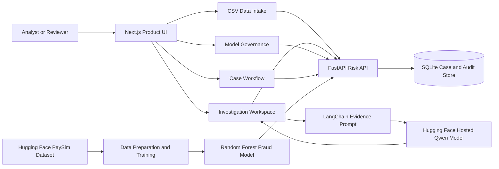

# Sentinel - Fraud Risk Command Center

> A visual, explainable fraud-operations platform built with Hugging Face datasets, machine learning, FastAPI, Next.js, LangChain prompts, and Hugging Face hosted inference.

> **Important:** Sentinel is an educational demonstration using synthetic PaySim-style data. It supports human-led investigation and does not make autonomous fraud decisions.

## Why Sentinel?

Fraud analysts need more than a raw anomaly score. They need to understand the evidence, prioritize review, document decisions, and retain a transparent audit trail.

1. Upload or choose transaction data
2. Score fraud risk using a trained ML model
3. Investigate a selected transaction
4. Generate a grounded AI investigator brief
5. Create, escalate, or close an auditable case
6. Review evaluation evidence and model limitations

## Product tour

### Fraud risk overview



### Scenario switching



### Transaction data intake



### Investigation and AI brief





### Auditable case workflow



### Model governance



## Demo video

[Watch the Sentinel workflow demo](docs/demo/sentinel-demo.webm)

## Architecture



## Core features

| Area | Capability |
|---|---|
| Risk dashboard | Model-scored alerts, risk bands, exposure, trends, and dataset switching |
| Data intake | CSV validation, demo scenarios, and in-memory batch scoring |
| Fraud model | Random Forest classifier trained on synthetic PaySim-style data |
| Investigation | Evidence review, risk scoring, and supporting-signal explanations |
| AI Copilot | Hugging Face hosted Qwen model with LangChain-grounded prompts |
| Case workflow | SQLite-backed case creation, escalation, closure, export, and audit events |
| Governance | Precision, recall, F1, ROC-AUC, confusion matrix, lineage, and limitations |

## Dataset scenarios

| Scenario | Records | Expected behavior |
|---|---:|---|
| Baseline monitoring | 1,000 | Realistic mix of normal and review-priority transactions |
| Routine payments | 20 | Mostly low-risk transactions |
| Mixed review queue | 20 | Low, medium, high, and critical outcomes |
| High-risk escalation | 20 | Predominantly critical transactions |

## Models and data

| Component | Technology |
|---|---|
| Fraud-risk classifier | Scikit-learn `RandomForestClassifier` |
| Dataset | `LordNR/AMLGraphX-Paysim` from Hugging Face |
| AI investigator brief | LangChain prompt orchestration |
| Hosted LLM | `Qwen/Qwen2.5-1.5B-Instruct` via Hugging Face Inference Providers |
| Case audit store | SQLite |

### Synthetic evaluation snapshot

| Metric | Result |
|---|---:|
| Precision | 100.0% |
| Recall | 97.6% |
| F1 score | 98.8% |
| ROC-AUC | 0.9975 |

These results are based on held-out **synthetic** data and must not be interpreted as production performance.

## Local setup

### Backend

```bash
python3 -m venv .venv
source .venv/bin/activate
pip install -r services/inference/requirements.txt
PYTHONPATH=services/inference python services/inference/scripts/train_model.py
PYTHONPATH=services/inference uvicorn app.main:app --host 0.0.0.0 --port 8000 --reload
```

### Hugging Face AI Copilot

```bash
read -s -p "Paste Hugging Face token: " HF_TOKEN
echo
export HF_TOKEN
```

### Frontend

```bash
cd web
npm install
npm run dev
```

## Security and responsible AI

- Uploaded CSV data is processed in memory and is not persisted.
- Dashboard counterparties are masked.
- The AI Copilot is instructed to use supplied evidence only.
- AI output cannot confirm fraud and requires qualified human review.
- Cases and status changes receive timestamped audit events.
- API keys are environment variables only and are never committed.
